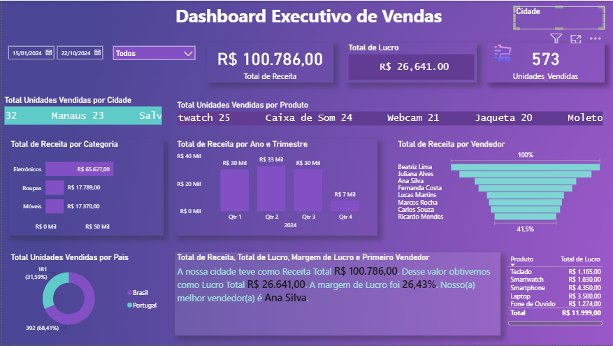

<p align="center">
  
</p>

# 📊 Dashboard Executivo de Vendas

### Power BI | DAX | Power Query | Storytelling com Dados

Projeto desenvolvido em **Power BI** com foco na análise estratégica de vendas, utilizando **Power Query**, **DAX** e técnicas de **Storytelling com Dados** para apoiar a tomada de decisão.

---

## ⭐ Destaques do Projeto

- 📈 Dashboard executivo desenvolvido para análise estratégica de vendas.
- 📊 KPIs dinâmicos atualizados automaticamente conforme os filtros aplicados.
- 💰 Acompanhamento de Receita Total, Lucro e Unidades Vendidas.
- 👥 Ranking de vendedores por desempenho.
- 📍 Análise geográfica por cidade e país.
- 📦 Monitoramento dos produtos mais vendidos.
- 📅 Evolução da receita por trimestre.
- 🧠 Narrativa dinâmica desenvolvida em DAX para geração automática de insights.

---

## 🎯 Objetivo

Desenvolver um dashboard executivo capaz de transformar dados de vendas em informações estratégicas para apoiar a tomada de decisão.

O projeto foi construído utilizando recursos do Power BI, Power Query e DAX, permitindo explorar os dados por meio de filtros interativos e indicadores dinâmicos, oferecendo uma visão clara sobre o desempenho comercial da empresa.

---

## 🛠️ Tecnologias e Competências Aplicadas

| Tecnologia | Aplicação no Projeto |
|------------|----------------------|
| 📊 **Power BI** | Desenvolvimento do dashboard e construção das visualizações interativas. |
| 🔄 **Power Query** | Extração, limpeza, transformação e modelagem dos dados. |
| 📐 **DAX (Data Analysis Expressions)** | Criação de KPIs, medidas, cálculos e narrativa dinâmica. |
| 📁 **Microsoft Excel / CSV** | Fonte de dados utilizada para análise. |
| 🎨 **UX & Data Visualization** | Construção de um layout executivo com foco na experiência do usuário e tomada de decisão. |

---

---

## 📈 KPIs e Funcionalidades

O dashboard foi desenvolvido para fornecer uma visão estratégica do desempenho comercial por meio de indicadores executivos e análises interativas.

### 📊 Indicadores (KPIs)

- 💰 Receita Total
- 💵 Lucro Total
- 📦 Total de Unidades Vendidas
- 📈 Margem de Lucro
- 👥 Ranking de Vendedores

### 🔎 Funcionalidades

- 📅 Filtro por período
- 🏙️ Análise por cidade
- 📦 Monitoramento dos produtos mais vendidos
- 🛍️ Receita por categoria
- 📊 Evolução da receita por trimestre
- 🌎 Distribuição das vendas por país
- 📈 Ranking de vendedores
- 🧠 Narrativa dinâmica desenvolvida em DAX
- ⚡ Atualização automática dos indicadores conforme os filtros selecionados

---

## 📷 Dashboard

Abaixo está uma visão geral do dashboard desenvolvido no Power BI.

<p align="center">
    
</p>

### 💡 Principais análises disponíveis

✔ Receita Total, Lucro Total e Unidades Vendidas

✔ Receita por Categoria

✔ Evolução da Receita por Trimestre

✔ Ranking dos Vendedores

✔ Produtos mais vendidos

✔ Distribuição geográfica das vendas

✔ Narrativa dinâmica para apoio à tomada de decisão


> **💡 Observação:** Todos os indicadores, gráficos e a narrativa executiva são atualizados dinamicamente conforme os filtros selecionados pelo usuário, proporcionando uma análise interativa e uma experiência mais intuitiva na exploração dos dados.
>
> 

---


## 💡 Principais Aprendizados

Durante o desenvolvimento deste projeto foram aplicados conceitos fundamentais de Business Intelligence, desde o tratamento dos dados até a construção de indicadores executivos.

### Competências desenvolvidas

- ✔ Modelagem de dados no Power BI
- ✔ Transformação e tratamento de dados utilizando Power Query
- ✔ Criação de medidas e indicadores com DAX
- ✔ Desenvolvimento de KPIs executivos
- ✔ Storytelling com dados para apoio à tomada de decisão
- ✔ Construção de dashboards interativos
- ✔ Boas práticas de Data Visualization
- ✔ Organização de projetos para publicação no GitHub

---

---

## 📂 Estrutura do Projeto

```text
dashboard-executivo-vendas-powerbi
│
├── dashboard
│   └── Dashboard_Executivo_Vendas.pbix
│
├── data
│   └── Dados_Vendas.csv
│
├── images
│   ├── cover.png
│   └── dashboard.png
│
├── README.md
└── LICENSE
```

---

## 👩‍💻 Sobre a Autora

Olá! Sou **Sabrina Sá**, Analista de Dados apaixonada por transformar dados em informações estratégicas para apoiar a tomada de decisão.

Tenho experiência na construção de dashboards executivos utilizando Power BI, Power Query e DAX, além de conhecimentos em SQL, Python e automação de processos.

Este projeto faz parte do meu portfólio profissional e representa minha evolução contínua na área de Business Intelligence e Analytics.

### Tecnologias

`Power BI` • `DAX` • `Power Query` • `SQL` • `Python` • `Excel`

---

⭐ Se este projeto foi útil ou interessante, considere deixar uma **Star** no repositório.

Obrigado pela visita!
